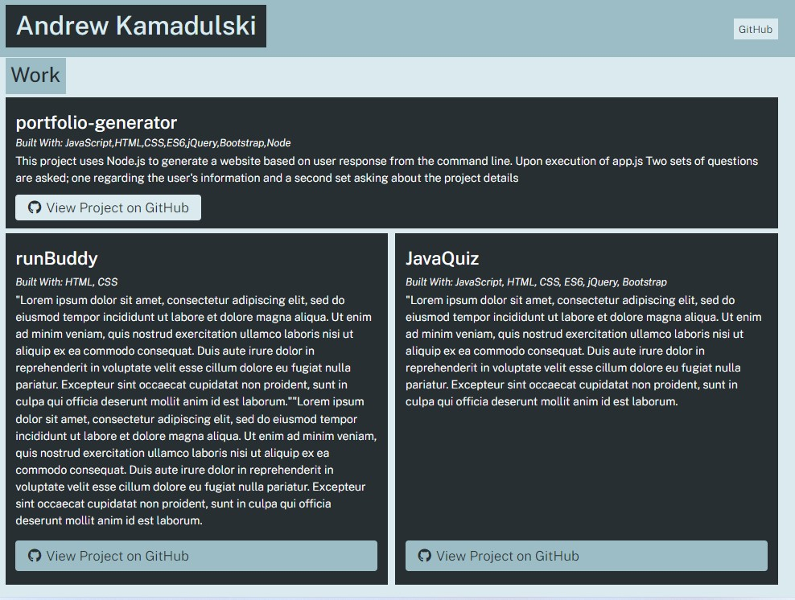

# Portfolio Generator

## Description
This project uses node.js to generate an HTML page based on user responses from the command line. Upon execution of app.js two series of questions will be asked; the first collecting user information and the second for information about the projects to be displayed. Once the questions are answered a personal profile page based on the user's responses is generated.   
  
 
  

## Instructions
To use the portfolio generator first clone the repository locally. From the command line type < npm i inquirer@8.2.4 > in the directory where you cloned the files. After running the npm type < node app.js > to execute the file. This dynamically generates an index.html file which will then need to be loaded in the browser. 

